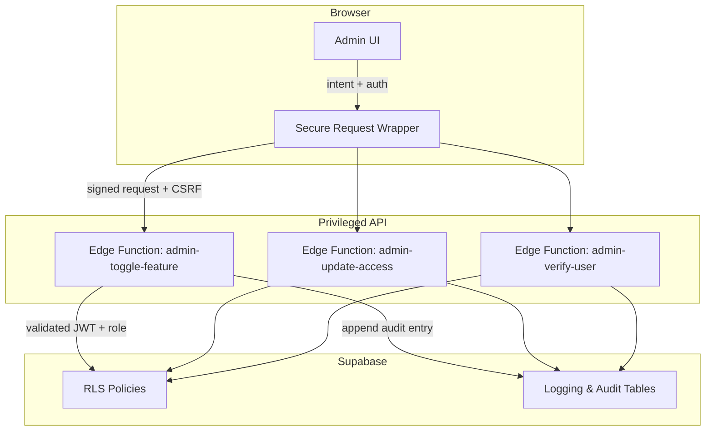

# Admin Experience Hardening Plan (RBAC, RLS, CSRF)

## 1. Objectives
- Ensure only authorized administrators can mutate feature flags, profiles, and verification workflows.
- Shift privileged operations away from the anon Supabase client to controlled server-side surfaces.
- Validate Row Level Security (RLS) policies and add redundant safeguards.
- Integrate CSRF protection and secure request utilities into admin flows.

## 2. Current Risk Summary
- [`Admin.tsx`](src/pages/Admin.tsx:77) performs `supabase.from('feature_flags').update` using the anon client; trust is placed entirely on client-side role assertions.
- Manual email verification uses [`supabase.rpc('manually_verify_user')`](src/pages/Admin.tsx:164) from the browser, allowing crafted payloads if RLS is misconfigured.
- Dashboard access toggles run via direct `profiles.update` calls with anon credentials.
- CSRF token from [`CSRFProtection.setToken()`](src/lib/securityUtils.ts:21) is never transmitted, leaving state-changing requests vulnerable to cross-site request forgeries.
- RLS coverage is assumed but not documented; there is no automated validation pipeline.

## 3. Target Architecture

### Key Principles
- Browser only issues signed requests to dedicated admin Edge functions.
- Edge functions verify Supabase JWT claims, enforce RBAC, and interact with tables using service role keys.
- All admin actions write to an audit log with actor, payload, and timestamp.
- RLS policies ensure read-only exposure for anon clients; privileged updates happen server-side.

## 4. Role-Based Access Control Enhancements
1. **JWT Claims**: Ensure admin users receive a custom claim (e.g., `app_role=admin`) via Supabase auth hook or trigger.
2. **Edge Function Validation**:
   - Parse JWT from `Authorization` header.
   - Reject if claim missing or user not in `profiles.role = 'admin'`.
3. **Client-Side Checks**:
   - Hide admin UI unless `profile.role === 'admin'`.
   - Add guard component that redirects non-admins and shows instrumentation for auditing attempted access.

## 5. RLS Validation & Documentation
1. Inventory policies for `feature_flags`, `profiles`, `esg_reports`, and any admin-touched tables.
2. Create automated policy tests:
   - Write SQL or Supabase CLI scripts verifying anon role cannot update target tables directly.
   - Include CI job that runs policy checks on migrations.
3. Document policy expectations in `docs/security/rls-policies.md` (future work), noting required roles for each operation.

## 6. Server-Side Function Design

### 6.1 `admin-toggle-feature`
- Input: `{ flagName: string, enabled: boolean }`
- Steps:
  1. Verify caller is admin.
  2. Update `feature_flags` table using service role client.
  3. Insert entry into `admin_audit_log`.
  4. Return updated flag state.

### 6.2 `admin-update-access`
- Input: `{ userId: string, dashboardAccess: boolean }`
- Guard: Prevent self-demotion (caller cannot change their own access).
- Use service role to update `profiles.dashboard_access`.
- Log action.

### 6.3 `admin-verify-user`
- Input: `{ userEmail: string }`
- Validate email format; ensure user exists.
- Call existing RPC or replicate logic server-side with service role.
- Log verification outcome.

All functions must enforce rate limiting (per admin) and include request metadata (IP, user agent) for auditing.

## 7. CSRF Integration
1. Extend `CSRFProtection` to expose `getTokenForRequest()`; include token in `SecureRequest` headers (`X-CSRF-Token`).
2. Edge functions validate token by comparing against Supabase session metadata or hashed token stored in KV (future improvement).
3. Admin UI wraps all `fetch`/invoke calls via `RequestSecurity.secureRequest`, which enforces CSRF, origin check, and retries.

## 8. UI & UX Adjustments
- Admin page should display clear gating: show locked message unless admin and `feature_flags_admin_enabled` is true.
- Add confirmation dialogs for destructive actions (revoking access, toggling critical flags).
- Provide success/error feedback with audit reference IDs to facilitate support inquiries.

## 9. Observability & Logging
- Create `admin_audit_log` table capturing: `id`, `actor_id`, `action`, `entity`, `payload_snapshot`, `result`, `timestamp`.
- Edge functions append to log after performing action.
- Surface recent admin actions in UI (read-only) to support accountability.

## 10. Rollout Plan
1. Implement Edge function scaffolding with service role key usage.
2. Update frontend to call new endpoints via `secureRequest`; remove direct `supabase.from().update` paths.
3. Configure Supabase CORS to accept admin dashboard origin only.
4. Run RLS regression tests ensuring anon client can no longer mutate admin resources.
5. Perform staged rollout (deploy edge functions, update RLS, then ship frontend changes).
6. Monitor audit log and Supabase metrics for unexpected access patterns.

## 11. Acceptance Criteria
- Admin actions function only when user JWT includes admin claim.
- Direct table updates from browser fail (confirmed via manual/API test).
- CSRF tokens are transmitted and validated for each admin mutation.
- Audit log entries exist for every admin toggle/update action.
- RLS policy verification suite passes in CI.

## 12. Future Enhancements
- Introduce IP allowlisting or device-based MFA for admin routes.
- Add scheduled policy drift detection (notify if RLS changed without review).
- Integrate with centralized logging/alerting (e.g., Logflare) for anomaly detection.