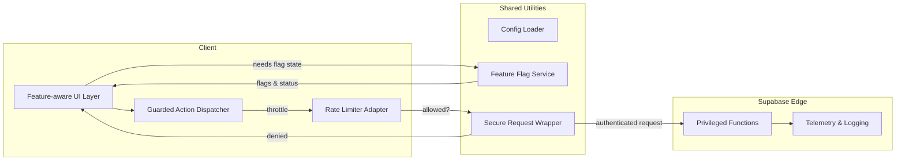

# Client Request Safeguards & Feature Gating Plan

## 1. Goals
- Eliminate unauthenticated or unintended triggers of cost-driving Supabase Edge functions.
- Restore backend-driven feature gating that respects real flag states instead of DEV overrides.
- Enforce client-side throttling and guardrails on high-risk interactions (uploads, waitlist submissions).
- Provide a clear architecture for toggling debugging tools without shipping them to production users.

## 2. Current Issues
- [`ESGUploadPanel`](src/components/ESGUploadPanel.tsx:57) auto-invokes `analyze-esg-report` on mount, creating unsolicited Edge calls, toasts, and logging noise.
- The “Test Edge Function” button in [`ESGUploadPanel`](src/components/ESGUploadPanel.tsx:626) is publicly accessible and hits production endpoints with the anon key.
- The waitlist form posts directly to the production Edge endpoint at [`https://equtqvlukqloqphhmblj.functions.supabase.co`](src/hooks/useWaitlistForm.tsx:53), bypassing environment routing.
- [`useFeatureFlags`](src/hooks/useFeatureFlags.tsx:6) forces `DEV_MODE = true`, effectively enabling all feature flags in production.
- Available security helpers ([`rateLimiter`](src/lib/rateLimiting.ts:39), [`RequestSecurity`](src/lib/securityUtils.ts:209)) are not wired into form submissions or Edge calls.

## 3. Architecture Overview



## 4. Feature Flag Integrity
1. Remove hard-coded `DEV_MODE` override. Default to `false`; allow runtime enabling via local storage or developer tooling that does not ship in production bundles.
2. Introduce `FeatureFlagContext` (or extend existing hook) that:
   - waits for Supabase flag fetch before rendering gated components,
   - exposes `isEnabled` and `requireFlag` helper which throws/logs when flag is missing.
3. Add “danger zone” gating: debugging buttons should check a `debug_tools_enabled` flag AND confirm `profile.role === 'admin'`.
4. Implement CI lint rule or unit test to fail if `DEV_MODE = true` literal exists in main branch code.

## 5. Edge Invocation Safeguards

### 5.1 Centralized Function Caller
- Create `src/lib/edgeFunctions.ts` exporting typed wrappers:
  ```ts
  export async function invokeAnalyzeReport(params: AnalyzePayload) {
    return secureInvoke('analyze-esg-report', params, { requiresAuth: true, featureFlag: 'esg_analysis_enabled' });
  }
  ```
- `secureInvoke` combines:
  - `RequestSecurity.secureRequest` for CSRF/origin validation.
  - `checkFormSubmissionLimit` (or new rate limiter keys) to throttle repeated attempts.
  - Role and feature flag checks before network call.

### 5.2 Upload Panel Adjustments
- Remove `useEffect` auto test. If debugging is needed, wrap behind `if (config.environment !== 'production' && isAdmin)` check.
- Bind “Test Edge Function” button visibility to both:
  - `isEnabled('debug_tools_enabled')`
  - `profile.role === 'admin'`
  - Possibly an explicit URL query param `?debug=true` during internal testing.
- Introduce exponential backoff or retry queue when manual test fails, preventing spamming.

### 5.3 Waitlist Form Routing
- Replace hard-coded fetch URL with `config.supabaseFunctionUrl`. Use staging endpoint in non-production environments.
- Apply `checkFormSubmissionLimit('waitlist', email)` before firing network request.
- On rate limit breach, read `getRemainingCooldown` and show user-friendly cooldown message.

## 6. Rate Limiting Strategy
1. Define action keys:
   - `edge_analyze_report`
   - `edge_secure_upload`
   - `waitlist_submit`
2. For logged-in users, use `profile.id` as identifier; for guests, fallback to hashed email or device fingerprint.
3. Persist limiter state in `sessionStorage` to reduce cross-tab abuse; fail closed when storage unavailable.
4. Combine with server-side rate limiting (future enhancement) by passing request metadata (e.g., hashed user ID) so backend can enforce as well.

## 7. Secure Request Integration
- Extend `RequestSecurity.secureRequest` to automatically append CSRF token and Supabase auth session.
- Wrap high-risk actions (`supabase.functions.invoke`, `fetch`) with this helper.
- Add telemetry hook to log denials (rate limit hit, missing flag) to Supabase logging table for visibility.

## 8. Developer Experience & Testing
- Provide `DEV_TOOLBAR` component (rendered only in development) granting quick access to manual function tests without affecting production users.
- Add unit tests for `secureInvoke` verifying:
  - Feature flag disabled returns error before network call.
  - Rate limiter denies additional calls within window.
  - CSRF token inclusion.
- Add E2E test scenario covering waitlist submission throttle and gated debug button visibility.

## 9. Rollout Steps
1. Implement config loader and feature flag fixes (dependency on Supabase hardening plan).
2. Refactor Edge invocations to go through new `secureInvoke`.
3. Remove auto-test effect; gate debug controls.
4. Integrate rate limiter + feedback UI for waitlist and upload flows.
5. QA across environments ensuring staging uses staging functions.
6. Monitor Supabase metrics post-deploy to confirm call volume drop and 4xx thresholds.

## 10. Acceptance Criteria
- Production users never see auto-test toasts or debug buttons.
- Feature flag toggles in Supabase immediately reflect in UI without hard-coded overrides.
- Rate limiter blocks repeated submissions with user-visible cooldown indicator.
- All network calls include CSRF token and respect environment-specific base URLs.
- Tests cover gating logic and throttling, preventing regressions.