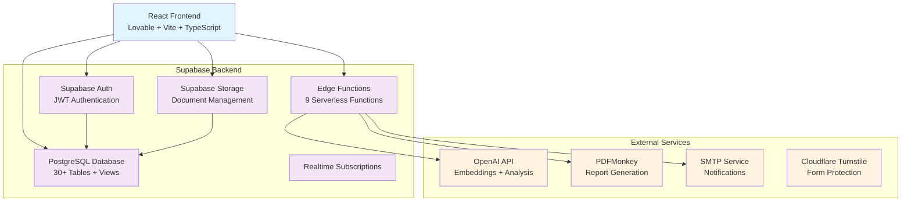
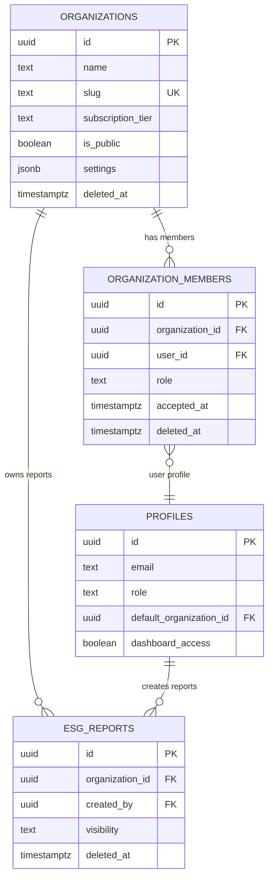
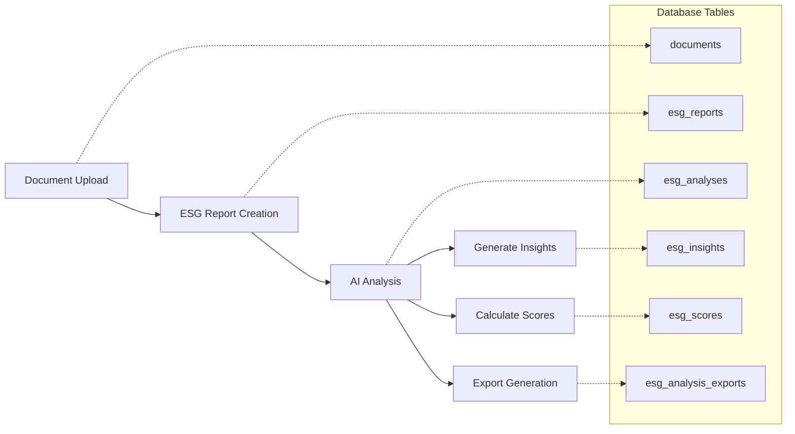
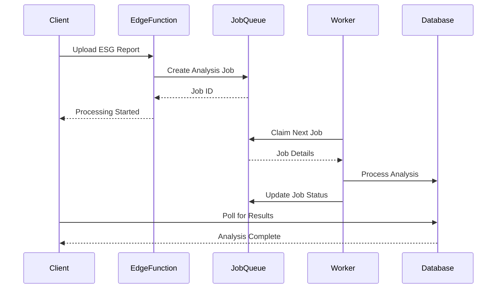
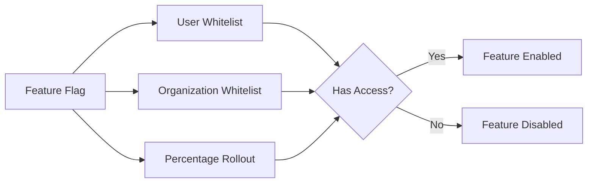
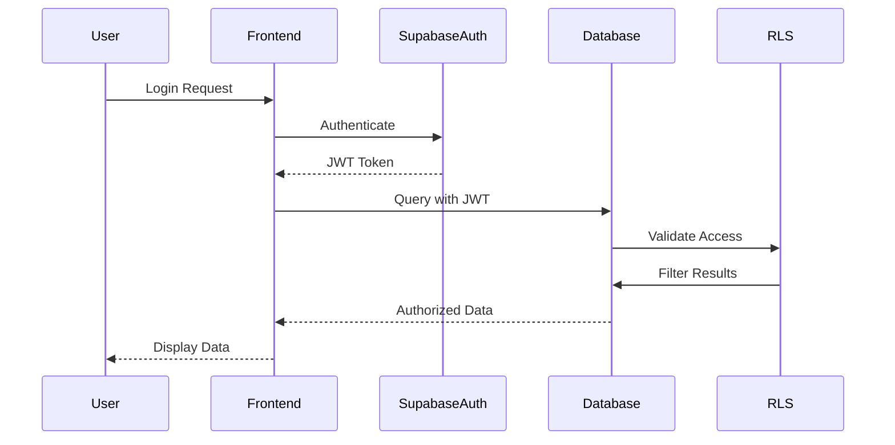
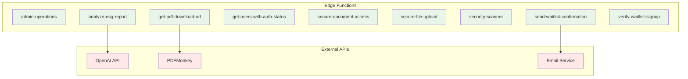
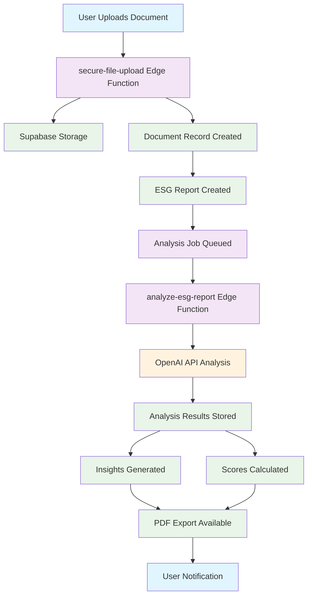

# ESGCheck Database Architecture Overview

## System Architecture

ESGCheck implements a modern, cloud-native architecture built on Supabase with a React frontend, providing enterprise-grade ESG reporting and analysis capabilities.



## Multi-Tenant Architecture

### Tenant Isolation Strategy

ESGCheck implements **organization-based multi-tenancy** with complete data isolation:



### Row Level Security (RLS) Implementation

Every table implements comprehensive RLS policies:

1. **Organization Isolation**: Users only access their organization's data
2. **Role-Based Access**: Owner > Admin > Member > Viewer permissions
3. **Public Data Handling**: Configurable public visibility
4. **Admin Overrides**: System administrators can access all data

## Data Architecture Layers

### 1. Core Data Layer (4 Tables)

**Purpose**: Foundation for multi-tenancy and user management
- `organizations`: Tenant isolation and subscription management
- `organization_members`: Role-based access control
- `profiles`: Extended user information beyond Supabase Auth
- `waitlist_entries`: Pre-launch user acquisition

### 2. Document Management Layer (5 Tables)

**Purpose**: Secure file storage with audit trails
- `documents`: File metadata with multi-tenant security
- `document_access_logs` (partitioned): Comprehensive access auditing

**Partitioning Strategy**:
```sql
-- Monthly partitions for scalability
document_access_logs_2025_08
document_access_logs_2025_09  
document_access_logs_2025_10
-- Auto-created via create_document_logs_monthly_partition()
```

### 3. ESG Reporting Layer (7 Tables)

**Purpose**: Complete ESG report lifecycle management



### 4. AI Knowledge Base Layer (3 Tables)

**Purpose**: Vector-powered ESG guideline search and matching

- `esg_frameworks`: Standard definitions (GRI, SASB, TCFD, CDP, IIRC)
- `esg_guidelines`: Specific guidelines within frameworks  
- `esg_guideline_embeddings`: 1536-dimension vectors for similarity search

**Vector Search Implementation**:
```sql
-- Similarity search function
CREATE FUNCTION search_guidelines(
  query_embedding vector(1536),
  match_threshold float DEFAULT 0.7,
  match_count int DEFAULT 10,
  framework_code text DEFAULT NULL
)
RETURNS TABLE(...) 
-- Returns similar guidelines with confidence scores
```

### 5. Job Processing Layer (2 Tables)

**Purpose**: Async task processing with enterprise features



**Job Queue Features**:
- Priority-based processing
- Retry logic with exponential backoff
- Idempotency key support
- Distributed worker support with SKIP LOCKED
- Correlation ID for request tracing

### 6. Audit & Security Layer (5 Tables)

**Purpose**: Comprehensive activity tracking and security monitoring

**Partitioned Audit Logs**:
```sql
-- Activity logs partitioned by month
CREATE TABLE activity_logs (
  id uuid,
  user_id uuid,
  action text,
  resource_type text,
  created_at timestamptz,
  PRIMARY KEY (created_at, id)
) PARTITION BY RANGE (created_at);
```

**Security Features**:
- All user actions logged with IP and user agent
- Security-specific events in dedicated audit log
- Automatic partition creation for scalability
- GDPR compliance with data anonymization

### 7. Configuration Layer (4 Tables)

**Purpose**: Dynamic system configuration and feature management

**Feature Flag Architecture**:


## Monitoring & Analytics Infrastructure

### Real-Time Monitoring (6 Views)

1. **`active_queries`**: Live database performance monitoring
2. **`table_sizes`**: Storage utilization tracking  
3. **`index_usage`**: Query optimization insights
4. **`job_queue_health`**: Async processing monitoring
5. **`organization_stats`**: Multi-tenant usage analytics
6. **`user_activity_summary`**: User engagement tracking

### Pre-Computed Analytics (1 Materialized View)

**`mv_organization_metrics`**: Dashboard performance optimization
- Concurrent refresh support for zero-downtime updates
- Organization KPIs and usage statistics
- ESG score averaging and trend analysis

## Performance Architecture

### Indexing Strategy

```sql
-- Composite indexes for multi-column queries
CREATE INDEX idx_esg_reports_org_status 
ON esg_reports(organization_id, status) 
WHERE deleted_at IS NULL;

-- Partial indexes for filtered queries  
CREATE INDEX idx_organizations_public 
ON organizations(is_public) 
WHERE is_public = true AND deleted_at IS NULL;

-- Vector indexes for AI search
CREATE INDEX idx_embeddings_vector 
ON esg_guideline_embeddings 
USING ivfflat (embedding vector_cosine_ops);

-- GIN indexes for JSONB search
CREATE INDEX idx_documents_metadata 
ON documents USING GIN(metadata);
```

### Partitioning Strategy

**Monthly Partitions** for high-volume tables:
- **Activity Logs**: User action tracking
- **Document Access Logs**: File access auditing
- **Auto-Partition Creation**: Scheduled monthly maintenance

**Benefits**:
- Query performance improvement via partition pruning
- Simplified data retention and archival
- Reduced index size and maintenance overhead

## Security Architecture

### Authentication & Authorization Flow



### Multi-Layer Security

1. **Application Layer**: Input validation and sanitization
2. **Authentication Layer**: Supabase Auth with JWT tokens
3. **Authorization Layer**: Row Level Security policies
4. **Database Layer**: Foreign key constraints and check constraints
5. **Audit Layer**: Comprehensive activity logging

### RLS Policy Examples

```sql
-- Organization isolation
CREATE POLICY "esg_reports_select" ON esg_reports FOR SELECT
USING (organization_id IN (SELECT user_organizations(auth.uid())));

-- Role-based access  
CREATE POLICY "org_members_update" ON organization_members FOR UPDATE
USING (organization_id IN (
  SELECT organization_id FROM organization_members 
  WHERE user_id = auth.uid() AND role IN ('owner', 'admin')
));

-- Public data access
CREATE POLICY "documents_select" ON documents FOR SELECT
USING ((organization_id IN (SELECT user_organizations(auth.uid()))) 
       OR (is_public = true));
```

## Integration Architecture

### Supabase Edge Functions (9 Functions)



### API Integration Patterns

**Async Processing Pattern**:
1. Client request → Edge Function
2. Edge Function → Job Queue  
3. Background Worker → External API
4. Worker → Database update
5. Client → Poll for completion

**Secure Document Pattern**:
1. Client → Document upload request
2. Edge Function → Validate and generate signed URL
3. Client → Direct upload to Supabase Storage
4. Edge Function → Process and create database record

## Scalability Considerations

### Horizontal Scaling

**Database Scaling**:
- Read replicas for analytics workloads
- Connection pooling via Supabase
- Partitioning for time-series data

**Application Scaling**:
- Stateless Edge Functions auto-scale
- CDN for static asset delivery
- Client-side caching and optimization

### Performance Optimization

**Query Optimization**:
- Materialized views for complex analytics
- Partial indexes for filtered queries  
- Composite indexes for multi-column searches

**Data Lifecycle Management**:
- Automated partition creation and cleanup
- Soft delete patterns with cleanup procedures
- GDPR-compliant data anonymization

## Data Flow Architecture

### ESG Report Processing Pipeline



## Deployment Architecture

### Production Environment

**Infrastructure Stack**:
- **Frontend**: Lovable deployment with CDN
- **Backend**: Supabase hosted PostgreSQL
- **Storage**: Supabase Storage with global CDN
- **Functions**: Supabase Edge Runtime (Deno)
- **Monitoring**: Built-in Supabase analytics + custom views

**Environment Configuration**:
- Production secrets via Supabase Vault
- Environment-specific feature flags
- Automated backup and recovery procedures
- Health check endpoints and monitoring

This architecture provides enterprise-grade ESG reporting capabilities with built-in scalability, security, and monitoring for production deployment.