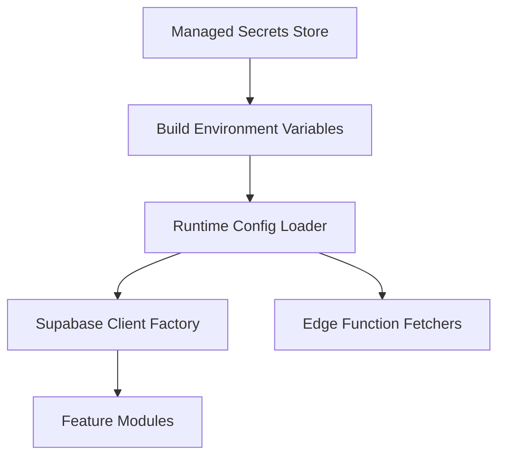

# Supabase Configuration Hardening & Key Rotation Plan

## 1. Objectives
- Remove hard-coded production credentials from the frontend bundle.
- Introduce environment-specific configuration that flows from `.env` to build output safely.
- Establish a repeatable secret rotation workflow for Supabase anon, service role, and JWT signing keys.
- Document safeguards that prevent accidental use of production services in development.

## 2. Current Risks
- Production Supabase URL and anon key are embedded directly in [`createClient()`](src/integrations/supabase/client.ts:7).
- Client-side modules call production endpoints unconditionally (example: [`useWaitlistForm`](src/hooks/useWaitlistForm.tsx:53), [`ESGUploadPanel`](src/components/ESGUploadPanel.tsx:57)).
- `.env.example` is present but not enforced, leading to secrets living in source.
- No defined playbook for rotating Supabase credentials or cascading the changes across environments.

## 3. Target Architecture



### Key Components
- **Managed Secrets Store**: Source of truth (e.g., Supabase dashboard, 1Password, Azure Key Vault) for Supabase keys per environment.
- **Build Environment Variables**: Injected via `.env.local`, CI secrets, or Vite `loadEnv` with environment-specific prefixes.
- **Runtime Config Loader**: Central utility that reads env vars, validates presence, and exposes typed configuration.
- **Supabase Client Factory**: Builds clients using runtime loader; differentiates anon client vs. privileged server-side contexts.
- **Feature Modules / Edge Fetchers**: Consume factory-provided clients; enforce environment checks before calling production endpoints.

## 4. Implementation Roadmap

### 4.1 Config Loader & Client Factory
1. Create `src/config/env.ts` that pulls from `import.meta.env` with validation (throw descriptive errors when required variables are missing).
2. Replace hard-coded literals in [`createClient()`](src/integrations/supabase/client.ts:7) with imports from `env.ts`.
3. Extend loader to expose:
   - `SUPABASE_URL`
   - `SUPABASE_ANON_KEY`
   - `SUPABASE_SERVICE_ROLE_KEY` (optional, server-only)
   - `SUPABASE_FUNCTION_URL`
   - `ENVIRONMENT` (derived from `VITE_APP_ENV` or similar)
4. For server-side contexts (Edge functions, Node scripts), mirror loader using `process.env`/`Deno.env`.

### 4.2 Environment Separation
1. Define `.env.development`, `.env.production`, `.env.test` with environment-specific values (never commit actual secrets).
2. Update `.gitignore` to ensure real `.env` files stay local.
3. Update `README.md` with setup instructions referencing `.env.example` and build commands (e.g., `bun dev`, `npm run build`).

### 4.3 Build-Time Safeguards
1. Configure Vite to expose only `VITE_*` variables to the client bundle.
2. Add CI validation step that fails build if required env vars are absent (e.g., `check-config` script leveraging Zod schema).
3. Introduce runtime guard preventing `production` Supabase URL usage when `ENVIRONMENT !== 'production'` unless explicit override is set.

## 5. Key Rotation Playbook

### 5.1 Supabase Keys
1. **Inventory**: List all keys currently in use (anon, service role, JWT secret) across environments.
2. **Rotation Window**: Schedule maintenance window; notify stakeholders due to potential downtime.
3. **Generate Replacements**:
   - Regenerate anon key.
   - Regenerate service role key.
   - Rotate JWT signing secret.
4. **Update Secrets Store**:
   - Replace values in the chosen secret manager.
   - Update environment-specific `.env.*` files locally and in CI/CD.
5. **Deploy Order**:
   - Update backend runtimes (Edge functions, Supabase config) with new service role/JWT keys first.
   - Deploy frontend/backend consuming anon key after backend is ready.
6. **Verify**:
   - Run smoke tests (sign-in, report upload, waitlist submission).
   - Monitor Supabase logs for auth failures or token signature errors.
7. **Revoke Old Keys**: Once verification passes, invalidate previous keys in Supabase dashboard.

### 5.2 Automation Hooks
- Add calendar reminders for quarterly key rotation.
- Script `.env` synchronization: `scripts/sync-env.ts` that pulls from secret manager and writes env files (gitignored).
- CI pipeline step to confirm new keys are used post-deploy.

## 6. Preventing Production Calls in Dev
1. Provide environment flag `VITE_USE_STAGING_SUPABASE=true` to toggle between staging and production endpoints.
2. In client modules, assert:
   ```ts
   if (config.environment !== 'production' && config.supabaseUrl.includes('prod-domain')) {
     throw new Error('Production Supabase URL detected in non-production environment');
   }
   ```
3. Update waitlist and edge-invocation helpers to use `config.supabaseFunctionUrl` rather than hard-coded domain strings.
4. For local development, supply mock/test functions or disable costly features via feature flags fetched from staging.

## 7. Documentation Deliverables
- Update `.env.example` with placeholders and comments describing each variable.
- Expand `README.md` with configuration instructions, rotation playbook summary, and environment switching guidelines.
- Create `docs/operations/supabase-rotation-runbook.md` (future task) capturing the detailed rotation checklist.

## 8. Acceptance Criteria
- Frontend bundle contains no literal Supabase URLs/keys.
- Running app in development uses staging (or local) Supabase environment by default.
- Rotation runbook executed once successfully with verification logs.
- CI fails when required env vars missing or when production endpoints are detected in non-production builds.